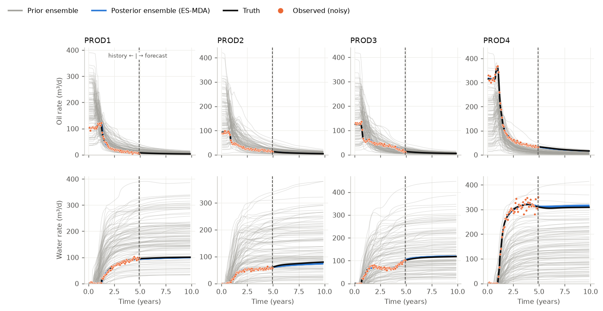
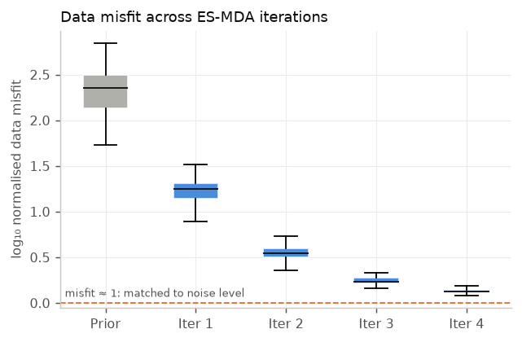
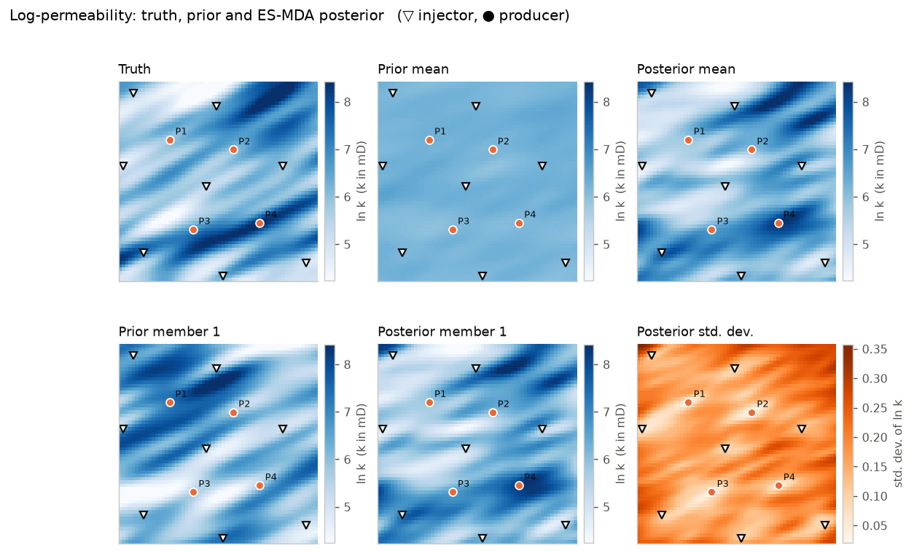

# ES-MDA History Matching on an Egg-Type Waterflood

Ensemble-based history matching in Python, using **ES-MDA** (Ensemble Smoother with Multiple Data Assimilation; Emerick & Reynolds, 2013) on a waterflood with the well layout of the **Egg Model** benchmark (Jansen et al., 2014): 8 water injectors, 4 producers, and a 60 × 60 grid of 8 m cells.

The project is small on purpose. It includes its own two-phase simulator, so it runs with only NumPy, SciPy and Matplotlib. No commercial software is needed.



## What it does

This is a **twin experiment**, the standard way to test a history-matching method:

1. A "true" permeability field is simulated for 10 years. Its well data for the first 5 years, with added noise, becomes the **observed history**.
2. A **prior ensemble** of 100 permeability fields is built. The truth is *not* one of them.
3. ES-MDA updates every member 4 times so that all 100 models reproduce the 5-year history.
4. Prior and posterior are compared on the history match, on the permeability maps, and on a **forecast** of years 5 to 10, which the method never saw.

**Observed data (960 values):** monthly oil and water rates at the 4 producers, plus monthly bottom-hole pressure (BHP) at the 8 injectors.
**Unknowns (3,600 values):** the natural log of permeability, ln k, in every grid cell.

## Results (default run: 100 members, 4 assimilations)

| Metric | Prior | Posterior |
|---|---|---|
| Mean normalised data misfit (≈1 means matched to the noise level) | 242 | **1.36** |
| RMSE of ln k, ensemble mean vs truth | 0.99 | **0.71** |
| RMSE of field oil-rate forecast, years 5–10 (m³/d) | 3.87 | **1.85** |

RMSE (root-mean-square error) is the typical size of the difference between estimate and truth.

The misfit falls by more than two orders of magnitude. Notably, the **forecast error roughly halves** even though the forecast period was never used in the match.





The posterior mean recovers the main high-permeability trends that connect injectors to producers, especially around P4. It does not recover detail in areas that the well data cannot "see".

## The method in plain terms

Each ensemble member is a candidate geological model, represented by a parameter vector *m* (ln k for every cell). Running the simulator on *m* gives the predicted data *d = g(m)*.

ES-MDA assimilates the same observations *N_a* times. At step *i*, each member is updated as follows:

```
d_uc  = d_obs + sqrt(alpha_i) * C_D^(1/2) * z          (perturbed observations, z ~ N(0, I))
m_new = m + C_MD (C_DD + alpha_i * C_D)^(-1) (d_uc - d)
```

- **d_obs** is the observed data. **C_D** is the observation-error covariance, which here is diagonal: 5% of each rate (with a 2 m³/d minimum) and 1 bar for pressures.
- **C_MD** is the cross-covariance between parameters and predicted data, estimated from the ensemble. It tells the update *which cells influence which data*.
- **C_DD** is the auto-covariance of the predicted data, also estimated from the ensemble.
- **alpha_i** is an inflation factor (here 9.33, 7, 4, 2). The condition **Σ 1/alpha_i = 1** makes the 4 small, damped updates add up to one full Bayesian update for a linear problem. Smaller steps behave better when the physics is non-linear.

The update is computed in the small ensemble space (100 × 100) with the Woodbury identity, so it stays cheap even when there are many data. See [`esmda_egg/esmda.py`](esmda_egg/esmda.py).

A unit test checks the implementation. On a linear-Gaussian problem, ES-MDA must reproduce the exact Kalman (Bayesian) posterior mean, and it does.

## The forward model

[`esmda_egg/simulator.py`](esmda_egg/simulator.py) is a 2D incompressible oil-water simulator that uses IMPES (IMplicit Pressure, Explicit Saturation):

- **Pressure:** a sparse linear solve with two-point flux transmissibilities (harmonic mean of permeability).
- **Saturation:** explicit upwind transport, with sub-steps limited by the CFL (Courant–Friedrichs–Lewy) stability condition.
- **Wells:** Peaceman well index. Injectors run at 79.5 m³/d of water and producers at a BHP of 395 bar.
- **Fluids and rock:** Egg Model values. These are oil viscosity 5 cP, water viscosity 1 cP, Corey exponents of 3, S_wc 0.2 (connate water saturation), S_or 0.1 (residual oil saturation), and porosity 0.2.

The seven 4 m layers of the Egg Model are collapsed into one 28 m layer. One 10-year run takes about 1–2 seconds.

## Using the real Egg Model realizations

By default, the prior and the truth are Egg-type Gaussian random fields with elongated, channel-like trends. To use the **real 101 Egg Model permeability realizations**, do the following:

1. Download `data.zip` from 4TU.ResearchData: <https://doi.org/10.4121/uuid:916c86cd-3558-4672-829a-105c62985ab2>
2. Unzip it, for example into `data/egg/`.
3. Run `python run_history_match.py --egg-dir data/egg`.

The loader reads the ECLIPSE `PERM*` include files and the active-cell mask. It collapses the 7 layers with a geometric mean, uses realization 0 as the truth and the others as the prior.

## Run it

```bash
pip install -r requirements.txt
python run_history_match.py            # full run (~10 min on 2 cores)
python run_history_match.py --ne 20 --na 2 --quick   # ~1.5 min smoke test
pytest -q                              # unit tests
```

Outputs are written to `results/metrics.json`, `results/ensembles.npz` and `figures/`.

## Limitations and next steps

- **Ensemble collapse.** The posterior spread is small (std of ln k < 0.35). With 100 members and 960 data, ES-MDA tends to underestimate uncertainty. The usual fix is **distance-based localization**, which limits each update to cells near the wells that respond to them. That is the next feature to add.
- **2D, incompressible, no gravity or capillary pressure.** These choices keep the code readable. A full 3D Egg run would call OPM Flow or another simulator from the same ES-MDA loop.
- **Gaussian prior.** Real channelized geology is non-Gaussian. Parameterizations such as PCA or level sets would preserve channel geometry better.

## References

- Emerick, A. A. & Reynolds, A. C. (2013). Ensemble smoother with multiple data assimilation. *Computers & Geosciences*, 55, 3–15.
- Jansen, J. D., Fonseca, R. M., Kahrobaei, S., Siraj, M. M., Van Essen, G. M. & Van den Hof, P. M. J. (2014). The Egg Model – a geological ensemble for reservoir simulation. *Geoscience Data Journal*, 1(2), 192–195.

## Author

Ogechi Osemeka, Reservoir & Production Engineer. MIT License.
